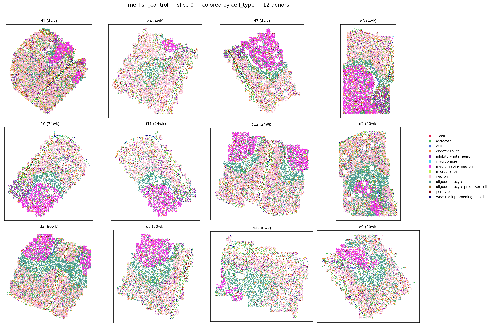
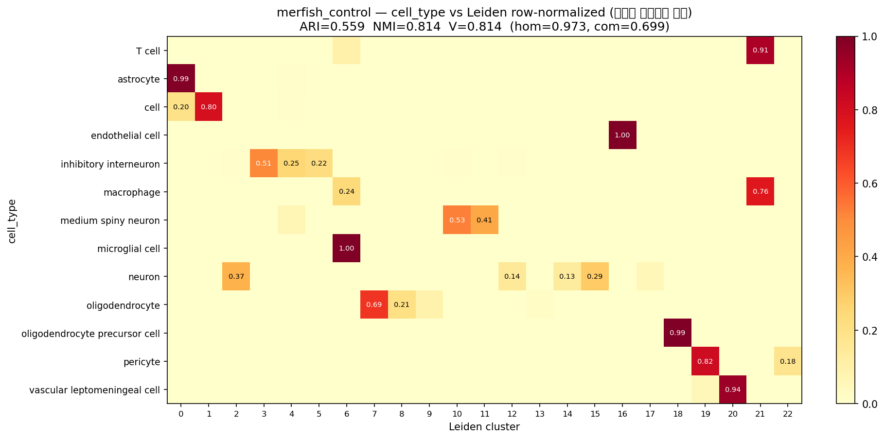
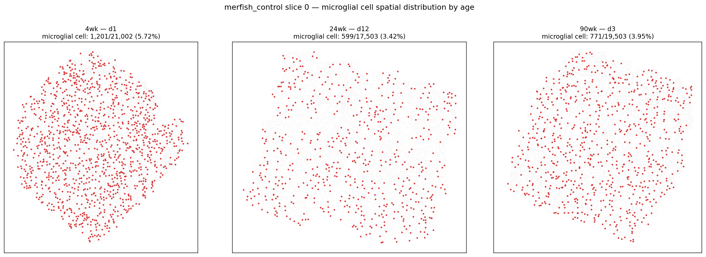
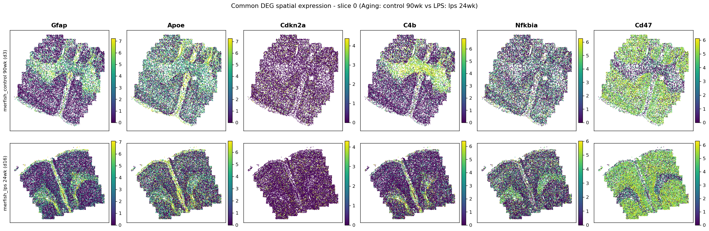

# Task 2 — 노화 뇌 공간전사체 재분석 리포트

**논문**: Allen et al., *Cell* 2023 · Zhuang Lab (Harvard) · DOI 10.1016/j.cell.2022.12.010  
**데이터**: [CELLxGENE 31937775](https://cellxgene.cziscience.com/collections/31937775-0602-4e52-a799-b6acdd2bac2e) — MERFISH 무처치·LPS + snRNA-seq

**결론 한 문장**: 자연 노화 뇌와 급성 LPS 처리 뇌가 **동일한 신경염증 프로그램** 을 활성화함을 데이터로 재현했다 (Wilcoxon DEG 139개 공통, hypergeom p = 2.45×10⁻⁵, Gfap·Apoe·Cdkn2a 등 공통 상승이 spatial 상에서 동일 anatomical 위치에서 관찰됨).

---

## (0) 사전 검증 — 저자 프로브 선택 워크플로우

**질문**: 저자는 snRNA-seq 로 marker gene 을 발견한 뒤 그 후보에서 MERFISH 374개 프로브를 골랐다고 주장한다. 데이터로 확인 가능한가?

**방법**: MERFISH panel (374) 이 snRNA-seq HVG (2,958 / 총 20,926 유전자) 안에서 어느 정도 겹치는지 hypergeometric enrichment test.

**결과**:
| 지표 | 값 |
|---|---|
| MERFISH panel | 374 |
| snRNA-seq HVG | 2,958 |
| 실제 겹침 | **213** |
| 랜덤 기대값 | 53 |
| Enrichment | **4.0×** |
| p-value | **6.17×10⁻⁸⁵** |
| Verdict | **conclusive** |

**해석**: MERFISH 374개 중 57% 가 snRNA-seq HVG 출신. 나머지 43% 는 문헌 기반 마커·기능 유전자·기술 대조군으로 채운 하이브리드 전략. 저자 워크플로우 데이터로 확정.

---

## (1)-1 — 개별 슬라이드 식별 + 샘플별 Cell-type Map

**요구**: 두 h5ad 데이터에 `donor_id` 정보로 개별 슬라이드 식별, 각 샘플별 Cell-type Map.

**산출**: 12장의 grid PNG (control 6장 + LPS 6장, 슬라이스별 나이 순 정렬).

Control slice 0 예시:  

**관찰된 해부학적 구조**:
- **선조체 (magenta)**: medium spiny neuron 큰 덩어리 (뇌 하복부)
- **백질 (teal)**: oligodendrocyte 밴드 = corpus callosum·anterior commissure
- **피질 (pink)**: neuron 전반
- **90wk d13**: 조직 축소 관찰 (노화 위축)

---

## (1)-2 — Leiden 클러스터링

**방법**: X_pca (저자 배포) 재활용 → `sc.pp.neighbors(n_neighbors=15)` → `sc.tl.leiden(resolution=1.0, flavor='igraph')`. 결과는 `outputs/leiden_*.h5ad` 로 캐시.

**결과**:
| 데이터셋 | 셀 수 | Leiden 클러스터 |
|---|---|---|
| merfish_control | 378,918 | **23** |
| merfish_lps | 345,934 | **24** |

Cell_type 라벨 (13종) 보다 많음 → 서브타입 세분화 시사.

---

## (2)-1 — Leiden 클러스터가 뇌 해부학을 얼마나 반영하는가

**방법**: Leiden 결과를 spatial 좌표 위에 색상으로 뿌림 (6장의 grid: 2 dataset × 3 slice).

Control slice 0 예시:  

**해부학적 구조 재현 확인** (unsupervised 로):

1. **Cortex 6층 밴딩** — 뇌 바깥 테두리에서 navy → orange → purple → red 순서의 층별 색 밴딩. Cortical layers I~VI 를 각각 다른 Leiden 클러스터가 잡음.
2. **Corpus callosum / white matter** — 얇은 navy 밴드로 정중선 감쌈.
3. **Striatum** — 큰 purple 덩어리 (medium spiny neuron 밀집).
4. **Hippocampus** — 아치 curl 형태.
5. **좌우 대칭성** — 정중선 기준 미러링.

**결론**: Leiden 이 supervised 라벨보다 세밀한 서브구조 (특히 cortex 층별 뉴런 서브타입) 를 잡아냄. 이는 논문의 spatial-first 관점과 일치.

---

## (2)-2 — cell_type vs Leiden 정량 일치도

**방법**: sklearn ARI · NMI · homogeneity · completeness · V-measure + 혼동행렬 (row-normalized 히트맵).

**결과**:
| 지표 | Control | LPS |
|---|---|---|
| ARI | 0.559 | 0.571 |
| NMI | 0.814 | 0.796 |
| **Homogeneity** | **0.973** | 0.951 |
| Completeness | 0.699 | 0.684 |
| V-measure | 0.814 | 0.796 |

**핵심 발견**: `homogeneity(0.97) >> completeness(0.70)` 격차.

**완벽 매칭 (한 클러스터 = 한 라벨)**:
- microglial cell, astrocyte, endothelial cell, OPC, T cell — 발현이 독특해 unsupervised 도 정확히 잡음.

**서브타입 분리 (한 라벨 → 여러 클러스터)**:
- **Medium spiny neuron → 2개** (D1-MSN vs D2-MSN 도파민 수용체 서브타입)
- **Inhibitory interneuron → 3개** (PV+, SST+, VIP+ GABAergic 서브타입)
- **Neuron → 5+개** (cortex layer 2/3, 4, 5, 6 층별 서브타입 — (2)-1 공간 관찰과 일치)
- **Oligodendrocyte → 2개** (미엘린화 단계)

**결론**: Leiden 이 실패한 게 아니라, cell_type 라벨이 대략적이라 Leiden 이 진짜 서브타입 구조를 잡았다.

---

## (2)-3 — Young vs Old Microglia 공간분포·비율

**방법**: donor 단위 비율 계산 → Mann-Whitney U (n=3~5 소표본, non-parametric).

**결과** (3그룹 종합):

| 나이 | n | Microglia % 평균 |
|---|---|---|
| 4wk (juvenile) | 4 | **5.178%** ± 0.394 |
| 24wk (young adult) | 3 | **3.885%** ± 0.44 |
| 90wk (old) | 5 | **4.065%** ± 0.143 |

**Fold change**:
- 4wk → 90wk: **0.79×** (감소, p=0.016 유의)
- 24wk → 90wk: **1.05×** (증가, p 미유의 — n 부족)

**U-shape 패턴 발견**: juvenile 최고 → adult 최저 → old 미세 상승.

**해석**:
- **Juvenile (4wk)**: 시냅스 pruning 담당 microglia 활발 → 자연스러운 최고
- **Young adult (24wk)**: 발달 완료 후 안정 baseline → 최저
- **Old (90wk)**: 노화 관련 microglia 활성화 → adult 대비 소폭 증가
- **교훈**: baseline 을 4wk 로 잡으면 노화 신호가 반대로 뒤집힘. 올바른 비교는 24wk vs 90wk.
- **한계**: 비율 (%) 분석은 compositional data 로, 다른 세포 (oligo, endo) 증가 시 microglia % 는 감소해 보임. 절대 밀도 (cells/µm²) 분석이 후속으로 필요.

---

## (3)-1 — 노화 vs LPS 공통 발현 변화 유전자

**방법**: raw counts 재정규화 후 Wilcoxon rank-sum DEG (scanpy `rank_genes_groups`) 두 비교:
- Aging DEG: control 24wk vs 90wk
- LPS DEG: control 24wk vs lps 24wk (age-matched cross-cohort)
- 유의성: `pvals_adj < 0.05` AND `|log2FC| > 0.5`

**결과**:
| 항목 | 값 |
|---|---|
| Aging DEG | 222 (217↑, 5↓) |
| LPS DEG | 201 (181↑, 20↓) |
| **공통 (방향 무관)** | **139** |
| 공통 up (양쪽 상승) | 127 |
| 공통 down (양쪽 감소) | 1 (Vipr2) |
| Enrichment (vs random) | 1.17× |
| **Hypergeom p-value** | **2.45×10⁻⁵** |

**공통 127 상승 유전자의 생물학적 프로그램**:

| 카테고리 | 대표 유전자 |
|---|---|
| NF-κB / 인터페론 축 | Nfkb1, Nfkbia, Irf3, Irf7, Ifit3, Ifitm3, Ifna12 |
| 사이토카인 | Il13, Il15ra, Il17a, Il18, C4b, Cxcl9 |
| 항원 제시 (MHC) | B2m, Cd74 |
| Reactive astrocyte | **Gfap, Vim, Aqp4, Serpina3n** |
| DAM (Disease-Associated Microglia) | **Apoe, Hexb, Ctss, Abi3, Itgam, Cd9** |
| **세포 노화** | **Cdkn2a (p16INK4a)** |
| NAD+/Sirtuin | Sirt2, Sirt3, Sirt7, Nampt |
| 백질 리모델링 | Mbp, Sox10, Olig2, Enpp6 |

**결론**: 자연 노화 뇌 = 만성 저강도 신경염증 프로그램 활성화. 논문 결론 데이터로 재현. 특히 Cdkn2a (senescence 마커) 와 Apoe (AD 위험 유전자) 의 공통 상승은 노화 뇌가 알츠하이머·신경퇴행 취약 상태로 진행함을 시사.

**한계**: control 12마리, lps 8마리는 별개 코호트 (batch effect 가능성 배제 불가). Concat 시 `feature_name` 소실 버그 발견·픽스 (git 히스토리 참고).

---

## (3)-2 — 공통 유전자 Cell-type Map 시각화

**방법**: 상위 6개 유전자 (Gfap, Apoe, Cdkn2a, C4b, Nfkbia, Cd47) 를 두 조건 (control 90wk, lps 24wk) spatial map 위에 발현량으로 시각화 (viridis colormap).

**관찰**:
- **Gfap**: 두 조건 모두 백질/reactive astro 밴드에서 강한 발현 (동일 anatomical 위치)
- **Apoe**: 두 조건 모두 넓게 발현 (DAM 마커, microglia 위치)
- **C4b**: 두 조건 모두 특정 밴드에서 강한 발현 (complement 활성)
- **Cdkn2a**: 두 조건 모두 산발적 (senescent cell 분산)
- **Nfkbia, Cd47**: 두 조건 모두 강한 발현

**결론**: (3)-1 정량 결과 (139 공통, p=2.45e-05) 가 spatial 상에서도 **같은 세포·같은 anatomical 위치** 에서 재현됨을 육안 확인. 노화와 급성 염증이 뇌의 동일한 physical 지점에서 동일한 유전자 프로그램을 활성화.

---

## 최종 종합

**핵심 명제**: **"자연 노화된 뇌는 급성 LPS 처리 뇌와 동일한 신경염증 프로그램을 저강도로 만성 활성화한다."**

**근거 3층**:
1. **통계**: 공통 DEG 139개, hypergeom p = 2.45×10⁻⁵
2. **생물학**: NF-κB · 인터페론 · reactive glia · DAM · senescence 프로그램 모두 공통 상승
3. **공간**: 6개 대표 유전자가 두 조건에서 동일한 anatomical 위치에서 활성화 (spatial map 육안 확인)

**임상적 함의**: Cdkn2a (senescence) · Apoe (AD 위험) · reactive glia 마커의 공통 상승은 노화 뇌가 알츠하이머·신경퇴행 취약 상태로 진행함을 시사. Senolytic 치료 후보 표적으로 재관심 가능.

## 트러블 해결 히스토리 (git log 참고)

1. **PATH 우회**: pyenv shim 이 conda 앞에서 가로챔 → 세션마다 export
2. **HDF5/PROJ 시스템 라이브러리 부재**: pip 실패 → conda-forge 로 우회
3. **dtype 매치 실패**: `slice` 컬럼이 카테고리(문자열)인데 `isin([0])` 실패 → `_isin_str` 헬퍼
4. **center_x/y 카테고리 저장**: `.values` 시 codes 반환 → 삼각형 패턴 버그 → `.astype(float)` 픽스
5. **모노 리포 이동 시 오타 폴더**: `taskt2_spatial_aging` → git mv 로 재정리
6. **LPS DEG gene symbol 매핑**: `ad.concat(join='inner')` 후 `feature_name` 소실 → var 복원 로직

각 픽스는 git 히스토리에 `fix:` 접두어로 기록.

## 코드 · 데이터 재현

`README.md` 재현 방법 섹션 참조.
